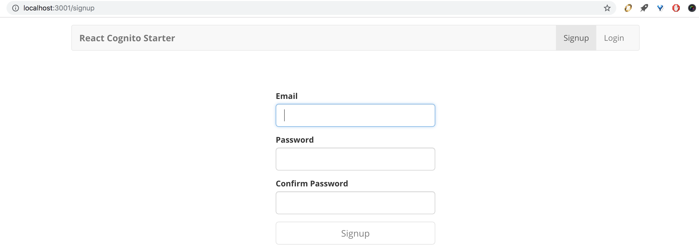
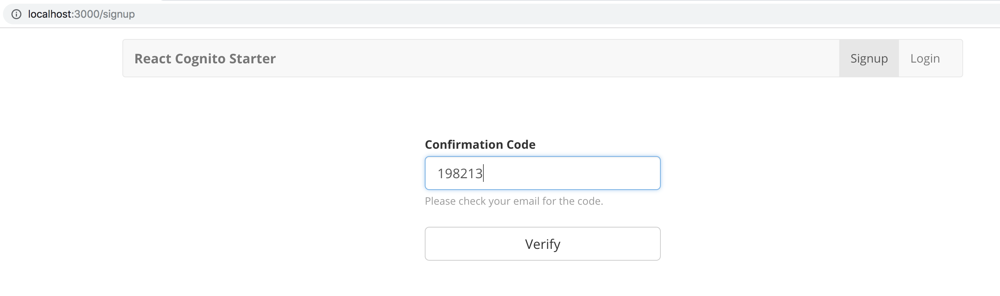

#### Serverless/Cognito/React starter.
This is a starter app that allows one to quickly get up and running with a simple authentication system on top AWS cognito,AWS amplify, serverless framework and React.

1. Execute `serverless deploy -v` which will produce output of several params that will be required for AWS amplify based react app to authenticate against the cognito.

````
CloudFormation - UPDATE_COMPLETE - AWS::CloudFormation::Stack - react-cognito-starter-dev
Serverless: Stack update finished...
Serverless: Invoke aws:info
Service Information
service: react-cognito-starter
stage: dev
region: us-east-1
stack: react-cognito-starter-dev
api keys:
  None
endpoints:
  None
functions:
  hello: react-cognito-starter-dev-hello

Stack Outputs
UserPoolClientId: 3eemob###############
UserPoolId: us-east-1_3##########
IdentityPoolId: us-east-1:f7a5b064-####################
HelloLambdaFunctionQualifiedArn: arn:aws:lambda:us-east-1:988996789928:function:react-cognito-starter-dev-hello:1
ServerlessDeploymentBucketName: react-cognito-starter-de-serverlessdeploymentbuck-###########
````
2. Simply copy the outputted values for UserPool and IdentityPool to corresponding file located at `client/src/config.js` 
3. Start the client app `cd client && npm start`
4. Sign up your user at `localhost:3000/signup`

5. Check your email that is used during the signup for verification code.

6. Enter the confirmation code.


#### To get the cognito output 
`sls info --stage=dev -v` or with aws profile `sls info --stage=dev --aws-profile=HA -v`